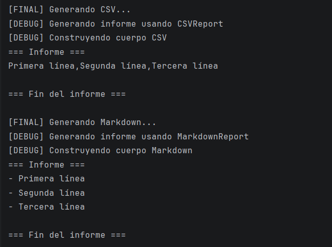

# Ejercicio 6.2 — Forzado y bloqueo de herencia (RA7.b)

Basado en la teoría de clases abstractas, interfaces y control de herencia.

## Objetivo

Partiendo de una versión base **sin** clase abstracta (v0), implementar una versión final que:

- use **una clase abstracta con sentido**,
- aplique mecanismos para **forzar** y **bloquear** la herencia/métodos,
- y mantenga el programa funcionando (con “logs” por consola).

## Entregables en este repositorio

- **Código Kotlin**:
  - Versión base (v0): `es.ies.ejercicios.u6.ej62.v0`
  - Versión final (con clase abstracta): `es.ies.ejercicios.u6.ej62` *(a completar por el alumnado)*
- **Documentación**: este fichero `docs/ejercicios/6.2.md`
  - Incluye **enlaces permanentes** a fragmentos de código (permalinks a líneas) en GitHub.

> Nota: el paquete `es.ies.ejercicios.u6.ej62` incluye una **plantilla** con `TODO(...)` para guiar la implementación, no una solución completa.

## Punto de partida (v0)

En `es.ies.ejercicios.u6.ej62.v0` tienes una implementación que **funciona**, pero **no** usa clase abstracta:

- Un `ReportGeneratorV0` con un `when` que decide el formato (CSV/Markdown).
- Un `enum` para representar el formato.
- Un `main` de demo con “logs” (`println`) para ver el resultado.

Ficheros (v0):

- `src/main/kotlin/es/ies/ejercicios/u6/ej62/v0/ReportGeneratorV0.kt`
- `src/main/kotlin/es/ies/ejercicios/u6/ej62/v0/ReportFormatV0.kt`
- `src/main/kotlin/es/ies/ejercicios/u6/ej62/v0/DemoV0.kt`

La idea del ejercicio es que detectes el problema típico: conforme aparecen más “tipos/formatos”, el `when` crece y el generador central acumula responsabilidades. En la versión final debes sustituir esa selección por **polimorfismo** usando una clase abstracta.

## Práctica

a) Partiendo del código base (v0), crea la versión final (en `ej62`) donde:

- Introduzcas **una clase abstracta con sentido** (no por “cumplir”).
- El diseño resulte más claro/extensible que la versión v0.
- Apliques mecanismos para:
  - **Forzar herencia/implementación** (p. ej. `abstract` + miembros `abstract`, o `interface`).
  - **Bloquear herencia/sobrescritura** (p. ej. clases/métodos `final` por defecto, o `final override`).
- Mantengas un `main` con ejemplos y “logs” (`println`) que demuestre el funcionamiento.

## Guía paso a paso (implementar con clase abstracta)

1) **Comprende el punto de partida (v0)**  
   - Ejecuta/lee la versión v0 y localiza dónde crece la complejidad (normalmente un `when`/`if` grande por “tipo/formato”).

2) **Separa lo común de lo variable**  
   - Escribe en una lista los pasos que siempre ocurren (algoritmo común).
   - Identifica qué partes cambian según el subtipo (lo que delegarás a subclases).

3) **Crea la clase abstracta “plantilla”**  
   - Declara `abstract class ...` en `es.ies.ejercicios.u6.ej62`.
   - Implementa el algoritmo común en un método público (p. ej. `generate(...)`).
   - **Bloquea** ese método: no lo marques `open` (o decláralo `final` explícitamente).

4) **Fuerza lo obligatorio**  
   - Declara al menos un miembro `abstract` para que cada subclase tenga que implementarlo.
   - Si necesitas puntos de extensión opcionales, añade “hooks” `open` (p. ej. `header(...)`, `footer()`).

5) **Crea subclases concretas**  
   - Implementa 2 subclases con comportamientos distintos.
   - Asegúrate de que el resultado es equivalente (o mejor) que en v0.

6) **Sustituye selección por polimorfismo**  
   - Cambia el código que elegía con `when` a trabajar con referencias del tipo padre (abstracto) y objetos de subclases.

7) **Añade una interfaz donde tenga sentido**  
   - Usa `interface`/`fun interface` para un rol transversal (p. ej. `Logger`).
   - Justifica en “Respuestas” por qué aquí conviene interfaz (y no herencia de clases).

8) **Demuestra bloqueo y forzado**  
   - “Forzar”: `abstract` + miembro `abstract` (obliga a implementar).
   - “Bloquear”: `final` por defecto, `final override`, o no exponer como `open` lo que no debe cambiar.

9) **Deja evidencias con logs**  
   - En el `main`, imprime mensajes claros para que se vea qué se ejecuta y qué resultado produce.

## Teoría (responder después de terminar la guía)

b) ¿Qué beneficios obtienes al usar una **clase abstracta**? ¿Y de una **interface**?

RESPUESTA: *(Escribe tu respuesta aquí. Añade permalinks a tu código si te apoyas en ejemplos.)*
- Clase abstracta (ReportTemplate):
    1. Permite definir un algoritmo común que todas las subclases usan, evitando duplicación:
       https://github.com/IES-Rafael-Alberti/2526-u6-6-1-5-relacionejercicios-Sromerop0610/blob/58a958bd28cde83e762d5fd8774d0c075dd6682d/src/main/kotlin/es/ies/ejercicios/u6/ej62/v1/ReportTemplate.kt#L10-L16
        - Todas las subclases usan generate, sin tener que reescribir la lógica de generación completa.
    
    2. Puede contener miembros concretos y abstractos:
       https://github.com/IES-Rafael-Alberti/2526-u6-6-1-5-relacionejercicios-Sromerop0610/blob/58a958bd28cde83e762d5fd8774d0c075dd6682d/src/main/kotlin/es/ies/ejercicios/u6/ej62/v1/ReportTemplate.kt#L19-L23
        El body() obliga a la subclase a implementar la parte variable. header() y footer() son opcionales de sobrescribir, permitiendo personalización.
- Interface:
  https://github.com/IES-Rafael-Alberti/2526-u6-6-1-5-relacionejercicios-Sromerop0610/blob/58a958bd28cde83e762d5fd8774d0c075dd6682d/src/main/kotlin/es/ies/ejercicios/u6/ej62/Logger.kt#L7-L9
    - Útil para roles transversales que pueden aplicarse a distintas clases sin forzar herencia.
    - Ejemplo: si quisiéramos que todos los informes pudieran hacer logging adicional, cualquier clase puede implementar Logger sin ser subclase de ReportTemplate.

c) ¿Qué modificadores y mecanismos has utilizado para **bloquear** y **forzar** la herencia de clases y métodos?

RESPUESTA: *(Escribe tu respuesta aquí, nombrando modificadores/mecanismos y enlazando a las líneas de código.)*

- Forzar implementación: https://github.com/IES-Rafael-Alberti/2526-u6-6-1-5-relacionejercicios-Sromerop0610/blob/58a958bd28cde83e762d5fd8774d0c075dd6682d/src/main/kotlin/es/ies/ejercicios/u6/ej62/v1/ReportTemplate.kt#L19
  Esto obliga a cada subclase (CSVReport y MarkdownReport) a implementar cómo generar el cuerpo del informe.

- Bloquear sobrescritura de métodos importantes: https://github.com/IES-Rafael-Alberti/2526-u6-6-1-5-relacionejercicios-Sromerop0610/blob/58a958bd28cde83e762d5fd8774d0c075dd6682d/src/main/kotlin/es/ies/ejercicios/u6/ej62/v1/ReportTemplate.kt#L10
El método generate() no es open, por lo que no puede ser sobrescrito en las subclases. Garantiza que el algoritmo principal permanezca intacto.

- Permitir extensión opcional controlada: https://github.com/IES-Rafael-Alberti/2526-u6-6-1-5-relacionejercicios-Sromerop0610/blob/58a958bd28cde83e762d5fd8774d0c075dd6682d/src/main/kotlin/es/ies/ejercicios/u6/ej62/v1/ReportTemplate.kt#L22-L23
  Los métodos header() y footer() son open, pero protected, lo que permite que las subclases los sobrescriban, pero evita que se llamen desde fuera directamente.

## Evidencias (salida por consola)

Pega aquí una ejecución breve que demuestre que el programa funciona y que se entienden los casos de uso.

RESPUESTA: *(Pega aquí la salida por consola de tu programa, con mensajes claros.)*

## Enlaces permanentes a código (obligatorio)

Incluye enlaces permanentes a:

- La versión v0 (punto de partida): `ReportGeneratorV0`, `ReportFormatV0` y `DemoV0`.

  RESPUESTA:
    https://github.com/IES-Rafael-Alberti/2526-u6-6-1-5-relacionejercicios-Sromerop0610/blob/58a958bd28cde83e762d5fd8774d0c075dd6682d/src/main/kotlin/es/ies/ejercicios/u6/ej62/v0/DemoV0.kt#L1-L12
    https://github.com/IES-Rafael-Alberti/2526-u6-6-1-5-relacionejercicios-Sromerop0610/blob/58a958bd28cde83e762d5fd8774d0c075dd6682d/src/main/kotlin/es/ies/ejercicios/u6/ej62/v0/ReportFormatV0.kt#L1-L6
    https://github.com/IES-Rafael-Alberti/2526-u6-6-1-5-relacionejercicios-Sromerop0610/blob/58a958bd28cde83e762d5fd8774d0c075dd6682d/src/main/kotlin/es/ies/ejercicios/u6/ej62/v0/ReportGeneratorV0.kt#L1-L28

- La versión final: `ReportTemplate` y las subclases que crees.

  RESPUESTA:
  https://github.com/IES-Rafael-Alberti/2526-u6-6-1-5-relacionejercicios-Sromerop0610/blob/58a958bd28cde83e762d5fd8774d0c075dd6682d/src/main/kotlin/es/ies/ejercicios/u6/ej62/v1/CsvReport.kt.kt#L1-L11
  https://github.com/IES-Rafael-Alberti/2526-u6-6-1-5-relacionejercicios-Sromerop0610/blob/58a958bd28cde83e762d5fd8774d0c075dd6682d/src/main/kotlin/es/ies/ejercicios/u6/ej62/v1/MarkdownReport.kt#L1-L11
  https://github.com/IES-Rafael-Alberti/2526-u6-6-1-5-relacionejercicios-Sromerop0610/blob/58a958bd28cde83e762d5fd8774d0c075dd6682d/src/main/kotlin/es/ies/ejercicios/u6/ej62/v1/ReportTemplate.kt#L1-L24

- El `main`/demo (por ejemplo `es.ies.ejercicios.u6.ej62.main` en `Ej62.kt`) y el punto donde se ven los “logs”.

  RESPUESTA: https://github.com/IES-Rafael-Alberti/2526-u6-6-1-5-relacionejercicios-Sromerop0610/blob/58a958bd28cde83e762d5fd8774d0c075dd6682d/src/main/kotlin/es/ies/ejercicios/u6/ej62/v1/Demo.kt#L1-L13

## Condiciones de entrega (según enunciado)

- Se entrega la URL al ejercicio resuelto en este repositorio (con código y documentación). El enlace a este Markdown (`docs/ejercicios/6.2.md`) se puede usar como referencia en Moodle.

## Recursos

- Teoría (clases abstractas e interfaces): https://revilofe.github.io/section1/u06/teoria/PROG-U6.1.-jerarquiaDeClases/#2-clases-abstractas-e-interfaces-forzando-la-herencia-y-especificacion
- Teoría (bloquear y forzar herencia): https://revilofe.github.io/section1/u06/teoria/PROG-U6.1.-jerarquiaDeClases/#19-bloquear-y-forzar-la-herencia-de-clases-y-metodos
- Enlaces permanentes a código (GitHub Docs): https://docs.github.com/es/get-started/writing-on-github/working-with-advanced-formatting/creating-a-permanent-link-to-a-code-snippet

## Criterios (autoevaluación)

- La clase abstracta está bien justificada y el programa sigue funcionando.
- Diferencio cuándo usar abstracta vs interface.
- He usado mecanismos de bloqueo/forzado de herencia de forma correcta.
- Código limpio, óptimo, comentado y con “logs” útiles.
- He añadido permalinks a fragmentos de código.
