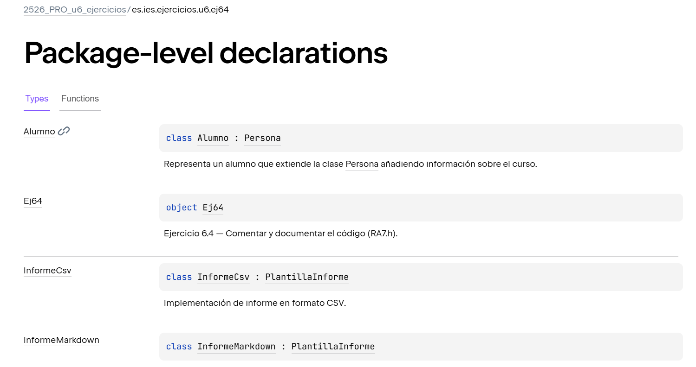
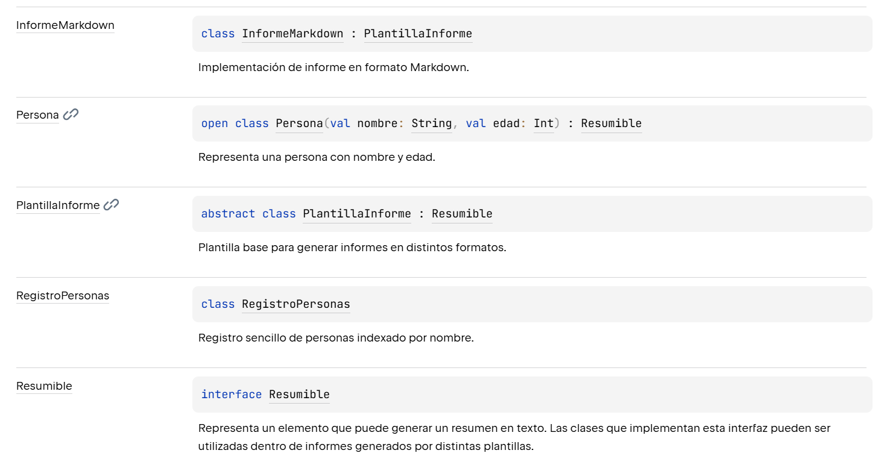

# Ejercicio 6.4 — Comentar y documentar el código (RA7.h)

Basado en la teoría de comentarios y documentación (KDoc/Dokka).

## Objetivo

Aprender a **documentar** correctamente un programa Kotlin usando **KDoc** y generar documentación HTML con **Dokka**, aplicando criterios para:

- añadir comentarios **necesarios** (aportan valor),
- evitar o eliminar comentarios **innecesarios** (redundantes/ruido),
- y dejar evidencias con enlaces permanentes a fragmentos de código.

## Entregables en este repositorio

- **Código** en `es.ies.ejercicios.u6.ej64` (se incluye una base “documentable”).
- **Documentación HTML generada por Dokka** en la carpeta `Doc/`.
- **Este Markdown** `docs/ejercicios/6.4.md` con:
  - memoria del proceso (instalación/ejecución),
  - captura o evidencia de la documentación generada,
  - respuestas teóricas,
  - permalinks a los cambios de código (añadir/quitar comentarios y KDoc).

## Práctica (código)

En el paquete `es.ies.ejercicios.u6.ej64` tienes un programa sencillo que mezcla conceptos de 6.1–6.3:

- herencia y subclases,
- clase abstracta e interfaces,
- constructores (`init`, primario/secundario) en jerarquías.

El programa genera informes (CSV/Markdown) de una lista de elementos “resumibles” (por ejemplo personas/alumnos) y además incluye una regla de negocio sencilla (normalización de nombre), ¿podría ser un buen candidato a comentario útil?.

Tarea:

a) Revisa el código y **añade KDoc** donde sea necesario (clases, funciones públicas, parámetros, retornos).  
b) Identifica **comentarios innecesarios** y elimínalos.  
c) Identifica partes donde un comentario **sí aporta valor** (por ejemplo, reglas de negocio o decisiones no evidentes) y añádelo o mejóralo.  
d) Actualiza/crea un `main` de demo (si lo necesitas) para poder ejecutar y ver “logs” por consola.

## Guía paso a paso (Dokka)

### 0) Configuración del proyecto (Gradle)

Este repositorio ya incluye la configuración mínima para generar HTML con Dokka:

- En `build.gradle.kts` se añade el plugin `org.jetbrains.dokka` para disponer de la tarea `dokkaHtml`.
- Se configura `tasks.dokkaHtml { outputDirectory = file("Doc") }` para que el HTML se genere en la carpeta `Doc/` (la carpeta que pide el enunciado).

Revisa estos cambios y entiéndelos antes de generar documentación.

1) Documenta el código con KDoc (antes de generar HTML).
2) Genera la documentación:
   - Si tienes wrapper: ejecuta `./gradlew dokkaHtml`.
   - Si no tienes wrapper o no funciona, ejecuta la tarea `dokkaHtml` desde IntelliJ (ventana Gradle).
3) Comprueba que se ha generado HTML en `Doc/`.
4) Añade una captura (imagen) o describe claramente qué se ha generado (pantalla principal, clases, etc.).

## Teoría (responder después de terminar la guía)

a) ¿Por qué es importante comentar/documentar? ¿Caul es la diferencia entre comentarios y documentación?

RESPUESTA:
Comentar y documentar el código es importante porque ayuda a entender mejor cómo funciona un programa. Cuando el código tiene explicaciones claras, cualquier persona que lo lea (incluido el propio programador tiempo después) puede comprender más fácilmente qué hace cada parte del programa y por qué está escrita de esa manera.

Además, los comentarios y la documentación facilitan el mantenimiento del software, ya que permiten modificar o mejorar el código sin tener que analizar todo desde cero. También ayudan a que varios desarrolladores puedan trabajar en el mismo proyecto de forma más organizada.

Diferencia entre comentarios y documentación:

- Comentarios: Son notas dentro del código dirigidas principalmente a los programadores. Sirven para explicar partes concretas del código, aclarar decisiones o describir qué hace un bloque de instrucciones.

- Documentación: Es una explicación más estructurada del código, normalmente escrita siguiendo un formato específico (como KDoc en Kotlin). La documentación describe elementos como clases, funciones, parámetros y valores de retorno, y puede generarse automáticamente en forma de documentación externa (por ejemplo, páginas HTML).

En resumen, los comentarios explican el código dentro del propio archivo, mientras que la documentación describe formalmente cómo usar el código y puede generarse como material de referencia para otros desarrolladores.

b) Describe **dos ejemplos** de comentarios importantes y necesarios (según la teoría) y enlaza a tu código.

RESPUESTA:

1. Comentarios para explicar decisiones de implementación o lógica no evidente

Estos comentarios se utilizan cuando el código realiza una operación cuya finalidad no se entiende fácilmente solo leyendo las instrucciones. Sirven para explicar por qué se hace algo de una determinada manera.

Ejemplo en el código:
https://github.com/IES-Rafael-Alberti/2526-u6-6-1-5-relacionejercicios-Sromerop0610/blob/517174bbea80b2e193ed866a62a59606a385d5b5/src/main/kotlin/es/ies/ejercicios/u6/ej64/ProgramaDocumentable.kt#L159-L167

Este comentario es importante porque explica la decisión de normalizar los nombres antes de guardarlos en el registro. Sin esta explicación, podría no entenderse por qué se eliminan espacios y se pasan los nombres a minúsculas.

2. Comentarios de documentación para clases o métodos (KDoc)

Este tipo de comentario describe qué hace una clase o método, qué parámetros utiliza y cuál es su finalidad. Se utiliza para generar documentación automática y para que otros programadores entiendan rápidamente cómo usar el código.

Ejemplo en el código:
https://github.com/IES-Rafael-Alberti/2526-u6-6-1-5-relacionejercicios-Sromerop0610/blob/517174bbea80b2e193ed866a62a59606a385d5b5/src/main/kotlin/es/ies/ejercicios/u6/ej64/ProgramaDocumentable.kt#L24-L31

c) Describe **dos ejemplos** de comentarios/documentación no importante o innecesaria y enlaza a tu código (antes/después).
RESPUESTA:
1. Comentario redundante que repite exactamente lo que hace el código

En el código original aparece el comentario:

Antes:
```kotlin
// Crea el StringBuilder
val sb = StringBuilder()
```
Este comentario es innecesario porque el propio código ya indica claramente lo que está ocurriendo. Cualquier persona que lea StringBuilder() entiende que se está creando un StringBuilder, por lo que el comentario no aporta información adicional.

Después (mejorado):
https://github.com/IES-Rafael-Alberti/2526-u6-6-1-5-relacionejercicios-Sromerop0610/blob/bee18fafdd62a0e59bf7b34b2cde2528aaa2811a/src/main/kotlin/es/ies/ejercicios/u6/ej64/ProgramaDocumentable.kt#L33

En la versión mejorada se elimina el comentario porque no aporta valor y solo añade ruido al código.

2. Comentario demasiado general que no explica realmente el funcionamiento del código
En el código original aparece este bloque al principio del archivo:

Antes:
```kotlin 
// Este fichero contiene ejemplos de:
// - herencia (6.1)
// - clase abstracta e interfaces (6.2)
// - constructores e init en herencia (6.3)
//
// Tu tarea (6.4) es:
// - Entender el código y su relación entre clases e interfaces.
// - Mejorar la documentación KDoc donde sea necesario.
// - Añadir comentarios solo cuando aporten valor.
// - Eliminar comentarios innecesarios o redundantes.
```
Este comentario no forma parte de la documentación del programa, sino que es una instrucción del ejercicio para el alumno. Por tanto, no es útil dentro del código final del programa.

Después (mejorado):

Ese bloque de comentarios se elimina y se sustituyen por comentarios KDoc en las clases y métodos, que explican realmente el funcionamiento del programa, por ejemplo:

https://github.com/IES-Rafael-Alberti/2526-u6-6-1-5-relacionejercicios-Sromerop0610/blob/bee18fafdd62a0e59bf7b34b2cde2528aaa2811a/src/main/kotlin/es/ies/ejercicios/u6/ej64/ProgramaDocumentable.kt#L3-L10

De esta forma la documentación pasa a ser más útil y orientada al funcionamiento del código, en lugar de contener instrucciones del ejercicio.


d) Porque la documentación se genera en el directorio `Doc/`? ¿Dónde se indica esto?

RESPUESTA: La documentación se genera en `Doc` porque en `build.gradle.kts`, en el apartado de pluggins, donde se llama a Dokka, pide que se genere en esa carpeta
```Kotlin
tasks.dokkaHtml {
    outputDirectory.set(file("Doc"))
}

```

## Enlaces permanentes a código (obligatorio)

Incluye enlaces permanentes a:

- KDoc que hayas añadido/mejorado.
Un buen ejemplo es la documentación de PlantillaInforme, porque explica el patrón que se usa y la relación con otras clases.
https://github.com/IES-Rafael-Alberti/2526-u6-6-1-5-relacionejercicios-Sromerop0610/blob/bee18fafdd62a0e59bf7b34b2cde2528aaa2811a/src/main/kotlin/es/ies/ejercicios/u6/ej64/ProgramaDocumentable.kt#L12-L23

He mejorado la documentación KDoc de la clase PlantillaInforme para explicar que utiliza el patrón Template Method y cómo se relaciona con las clases Persona, Alumno y la interfaz Resumible.

O en el método generar:
https://github.com/IES-Rafael-Alberti/2526-u6-6-1-5-relacionejercicios-Sromerop0610/blob/bee18fafdd62a0e59bf7b34b2cde2528aaa2811a/src/main/kotlin/es/ies/ejercicios/u6/ej64/ProgramaDocumentable.kt#L24-L31

Donde he añadido documentación KDoc con @param y @return para explicar los parámetros y el valor devuelto del método.

- Comentarios que hayas añadido porque aportan valor.

https://github.com/IES-Rafael-Alberti/2526-u6-6-1-5-relacionejercicios-Sromerop0610/blob/bee18fafdd62a0e59bf7b34b2cde2528aaa2811a/src/main/kotlin/es/ies/ejercicios/u6/ej64/ProgramaDocumentable.kt#L163-L165

Este comentario aporta valor porque explica por qué se normaliza el nombre, algo que no es evidente solo leyendo el código.

- Comentarios innecesarios que hayas eliminado.

En el código original aparece el comentario:

Antes:
```kotlin
// Crea el StringBuilder
val sb = StringBuilder()
```
Este comentario es innecesario porque el propio código ya indica claramente lo que está ocurriendo. Cualquier persona que lea StringBuilder() entiende que se está creando un StringBuilder, por lo que el comentario no aporta información adicional.

Después (mejorado):
https://github.com/IES-Rafael-Alberti/2526-u6-6-1-5-relacionejercicios-Sromerop0610/blob/bee18fafdd62a0e59bf7b34b2cde2528aaa2811a/src/main/kotlin/es/ies/ejercicios/u6/ej64/ProgramaDocumentable.kt#L33

En la versión mejorada se elimina el comentario porque no aporta valor y solo añade ruido al código.


## Evidencias

- Captura o descripción de la documentación HTML generada en `Doc/`.




- (Opcional) salida por consola si tu demo ayuda a entender el programa.

## Recursos

- Teoría (comentarios y documentación): https://revilofe.github.io/section1/u06/teoria/PROG-U6.4.-comentariosYDocumentacion/
- Enlaces permanentes a código (GitHub Docs): https://docs.github.com/es/get-started/writing-on-github/working-with-advanced-formatting/creating-a-permanent-link-to-a-code-snippet

## Criterios (autoevaluación)

- He añadido KDoc donde corresponde y es útil.
- He eliminado comentarios innecesarios y he justificado por qué.
- He añadido comentarios solo cuando aportan valor (según la teoría).
- He generado Dokka HTML y lo he dejado en `Doc/`.
- He documentado el proceso y añadido permalinks a los cambios.
